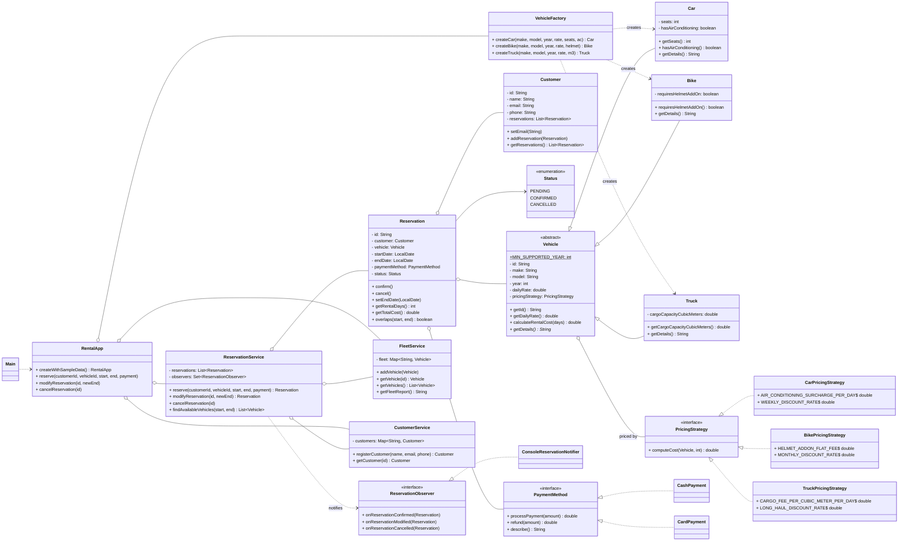

# Vehicle Rental & Fleet Management System

A small rental company in a single Maven project: a **mixed fleet** of cars,
bikes and trucks, **customers**, **reservations** with double-booking
protection, **duration-aware pricing**, **cash/card payments**, and
**notifications** for every reservation event — all in **core Java 17**
(no Spring, no database, no GUI).

## Features

- **Mixed fleet** — `Car` (seats, air-conditioning), `Bike` (helmet add-on),
  `Truck` (cargo capacity in m³), all extending an abstract `Vehicle`.
- **Customers** — registration with validated contact data, each customer
  keeps their own reservation history.
- **Reservations** — reserve an available vehicle for a date range; the
  service checks availability **before** confirming, so double-booking is
  impossible (ranges that merely touch — one ends where the other starts —
  do not conflict).
- **Pricing that varies by type *and* duration**:
  | Type  | Rules |
  |-------|-------|
  | Car   | daily rate; +$4/day if air-conditioned; 10% off from 7 days |
  | Bike  | daily rate; flat $5 helmet add-on when required; 10% off from 30 days |
  | Truck | daily rate + $2.50 per m³ of cargo per day; 15% off from 14 days |
- **Payments** — `CashPayment` or `CardPayment` (validated 16-digit number,
  per-charge limit) chosen at checkout; declines leave no reservation
  behind.
- **Modify & cancel** — extending/shortening a confirmed reservation
  re-checks availability, charges or refunds the difference, and rolls back
  cleanly on failure; cancellation refunds the full amount.
- **Notifications** — a console observer is notified when a reservation is
  confirmed, modified or cancelled.
- **Console UI** — an interactive menu, plus a scripted demo that runs the
  whole story end to end.

## Requirements

- Java 17+
- Maven 3.6+

## Build & run

```bash
mvn test            # run the 94-test JUnit 5 suite
mvn exec:java       # interactive console menu (on a terminal)
mvn exec:java -Dexec.args="--demo"   # scripted demo (also the fallback
                                      # when there is no interactive terminal)
```

The app starts with a small sample fleet (two cars, a bike, a truck) and two
customers so every menu option is usable immediately.

## Package structure

```
src/main/java/com/rental/
  Main.java                  entry point (menu vs demo)
  RentalApp.java             composition root: wires services, seeds sample data
  model/
    Vehicle.java             abstract base: validated identity, rate, cost delegation
    Car.java / Bike.java / Truck.java
    Customer.java            validated contact data + reservation history
    Reservation.java         PENDING/CONFIRMED/CANCELLED life cycle, overlap logic
    ReservationObserver.java Observer interface for reservation events
  pricing/
    PricingStrategy.java     interface: computeCost(vehicle, days)
    CarPricingStrategy.java / BikePricingStrategy.java / TruckPricingStrategy.java
    Money.java               cent rounding
  payment/
    PaymentMethod.java       interface: processPayment / refund / describe
    CashPayment.java / CardPayment.java
  service/
    FleetService.java        Map<String, Vehicle> + polymorphic reports
    CustomerService.java     Map<String, Customer>, generated ids
    ReservationService.java  availability, payment, lifecycle, notifications
    ConsoleReservationNotifier.java
  factory/
    VehicleFactory.java      single creation point, VH-xxx ids
  exception/
    RentalException.java            unchecked base
    InvalidReservationException.java
    VehicleNotFoundException.java
    CustomerNotFoundException.java
    DuplicateVehicleIdException.java
    PaymentDeclinedException.java
    VehicleUnavailableException.java  (checked)
  ui/ConsoleMenu.java          interactive menu
  demo/DemoRunner.java         scripted end-to-end scenario

src/test/java/com/rental/      JUnit 5 tests mirroring the structure above
```

## Where the OOP requirements live

| Principle | Where |
|-----------|-------|
| **Encapsulation** | Every field is private. Constructor validation: a `Vehicle` cannot have a non-positive daily rate or an out-of-range year; a `Reservation` cannot have an end date before its start date (checked again in `setEndDate`); `Customer` validates e-mail/phone in the constructor *and* in the `setEmail` setter. Collections are exposed only as unmodifiable copies (`List.copyOf`). |
| **Abstraction** | `Vehicle` is an abstract class exposing `calculateRentalCost(days)` (final: validate → delegate → round) and `getDetails()` (abstract, implemented per type) without exposing how the cost is computed. All services and reports work against `Vehicle`, never a subtype. |
| **Inheritance** | `Car`, `Bike`, `Truck` extend `Vehicle` and add type-specific attributes, constructor validation, the matching `PricingStrategy`, and a genuinely different `getDetails()`. |
| **Polymorphism** | The fleet is a `Map<String, Vehicle>`; reports (`getFleetReport`, `getTotalDailyRate`), the availability report and the reservation flow call only base-type methods — there is **no `instanceof` branching in application code** (the only `instanceof` checks are defensive guards *inside* the strategies, which are written for exactly one subtype). |

## Design patterns & principles

- **Strategy — pricing** (`PricingStrategy` + one implementation per vehicle
  class). *Why:* the rate rules vary per vehicle class and per duration;
  moving them out of the subclasses means a new rate plan is a new class,
  not an edited `if`-chain. `Vehicle` only knows the interface.
- **Strategy — payment** (`PaymentMethod` + `CashPayment` / `CardPayment`).
  *Why:* the reservation flow depends on "charge / refund", not on how the
  money moves; a new payment method (wallet, bank transfer) is added without
  touching services or UI.
- **Factory — `VehicleFactory`**. *Why:* one place assigns ids
  (`VH-001`, ...), knows every concrete constructor, and returns the base
  type, so callers can treat vehicles polymorphically from the start.
- **Observer — `ReservationObserver` + `ConsoleReservationNotifier`**.
  *Why:* "notify when confirmed / modified / cancelled" is cross-cutting;
  the service keeps a set of observers and a new notification channel
  (e-mail, SMS) is a new implementation + one `addObserver` call.
- **Open/Closed (SOLID)**: adding a vehicle type = new model subclass + new
  pricing strategy + one factory method; adding a payment method = one new
  class. No existing class changes for either.
- **Single Responsibility**: models hold state + invariants, services hold
  workflow, strategies hold rules, UI holds I/O — none of them mix those.
- **Generics / Collections**: `Map<String, Vehicle>`, `Map<String, Customer>`,
  `List<Reservation>`, `Set<ReservationObserver>` — no raw types anywhere.

## Error handling

| Exception | Kind | Thrown when |
|-----------|------|-------------|
| `InvalidReservationException` | unchecked | end date not after start, unknown reservation id, illegal status transition |
| `VehicleNotFoundException` | unchecked | unknown vehicle id |
| `CustomerNotFoundException` | unchecked | unknown customer id |
| `DuplicateVehicleIdException` | unchecked | adding a vehicle with an existing id |
| `PaymentDeclinedException` | unchecked | negative amount or card charge above the limit |
| `VehicleUnavailableException` | **checked** | the requested range overlaps a confirmed reservation |

Rationale: "you called me wrong / the state is corrupt" errors are
unchecked; the one **anticipated business outcome** (the vehicle is simply
booked) is checked, so the compiler forces every caller to handle it
deliberately. Services never return `null` or print errors.

## UML class diagram



## Testing

`mvn test` runs **94 JUnit 5 tests** in 16 classes mirroring the main
structure. Focus areas:

- **Pricing logic** — strategy-level math for all three vehicle types
  (surcharges, flat fees, discount thresholds) plus vehicle-level rounding.
- **Reservation conflicts** — overlapping ranges rejected, touching ranges
  accepted, availability re-check on modification **with rollback**,
  cancelled vehicles become bookable again.
- **Payment interplay** — declined payment leaves no reservation;
  extensions charge the delta; shortenings and cancellations refund
  (verified with a recording `PaymentMethod` test double).
- **One test class per vehicle type** plus base-class validation, factory
  ids, and observer notification counts.

## How to extend this

- **New vehicle type** (e.g. `Van`):
  1. `model/Van.java extends Vehicle` — add its attributes + constructor
     validation + `getDetails()`.
  2. `pricing/VanPricingStrategy.java implements PricingStrategy`.
  3. Install it in `Van`'s constructor (`super(..., new VanPricingStrategy())`).
  4. Add `VehicleFactory.createVan(...)`.
  Nothing else changes — the fleet, reservations, reports and UI all treat
  it as a `Vehicle`.
- **New payment method** (e.g. wallet): implement `PaymentMethod`, then
  `new WalletPayment(...)` at the checkout. No service/UI edits.
- **New rate plan**: implement `PricingStrategy` and hand it to a vehicle
  subclass (or parameterise the subclass constructor) — existing strategies
  stay untouched.
- **New notification channel** (e-mail, SMS): implement
  `ReservationObserver` and call `reservationService.addObserver(...)`.

## Out of scope

No database, no web framework, no GUI — the whole system runs from
`Main` via `mvn exec:java` (or any IDE run configuration).
